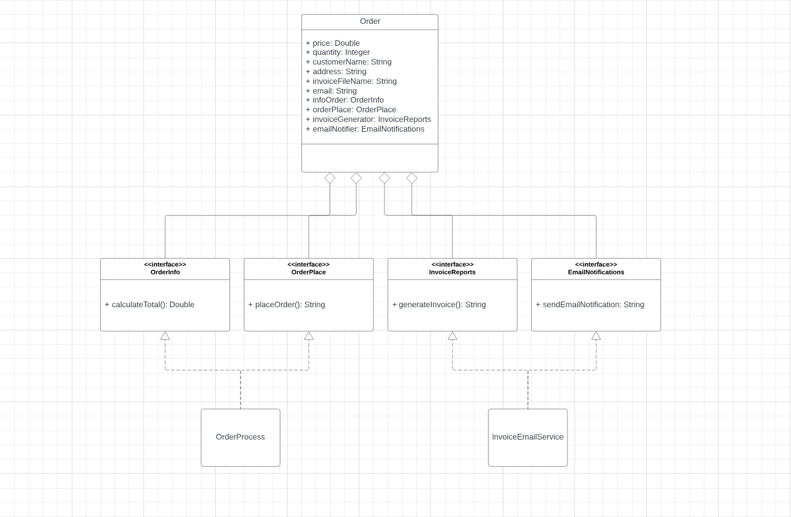

# Lab6SOLIDPrinciples
Improving the following codes to make them adhere to SOLID principles in OOP involves refactoring to separate responsibilities into individual classes, using interfaces to define behaviors, and applying best practices for extensibility and maintainability.

UML CLASS DIAGRAM:

